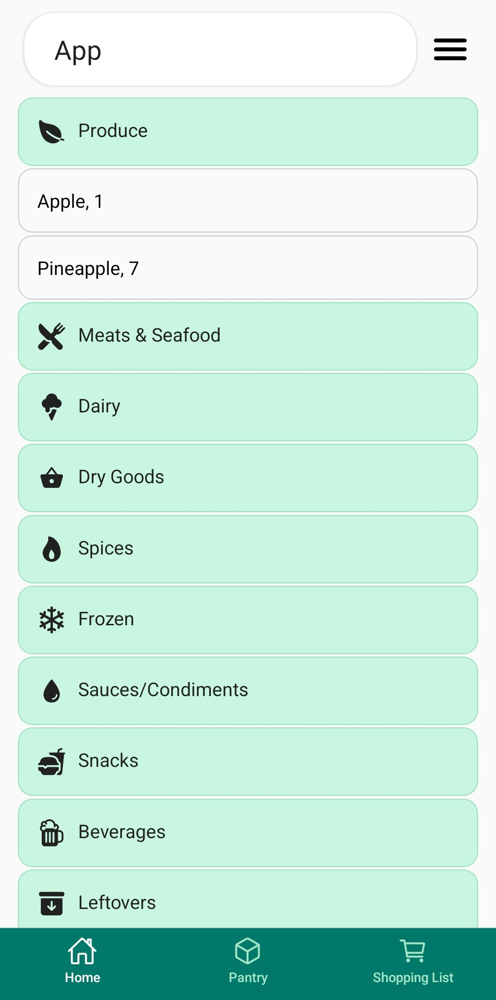
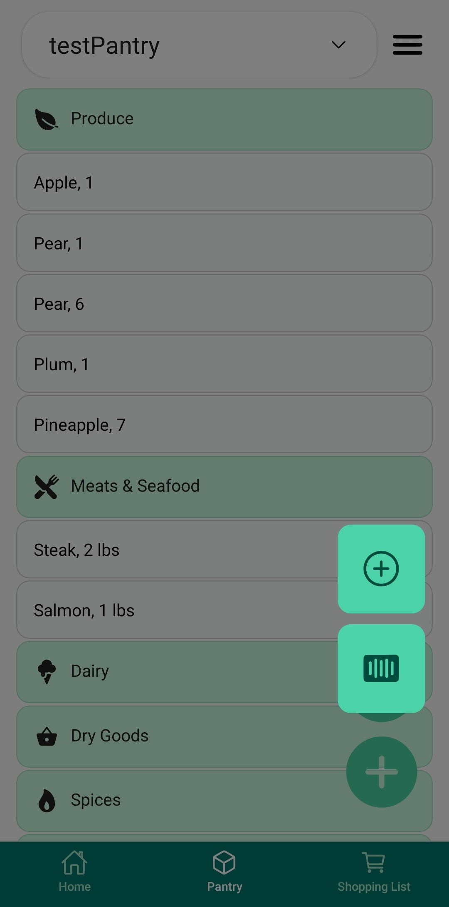
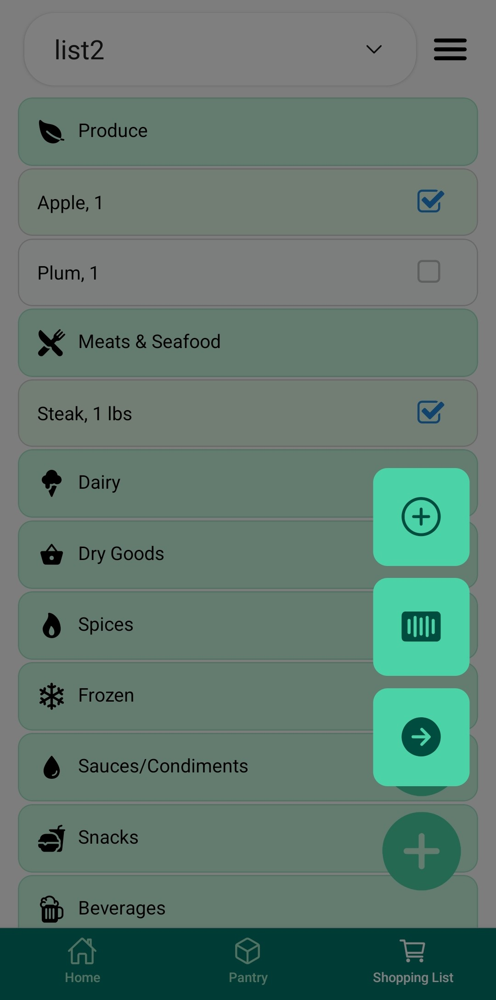
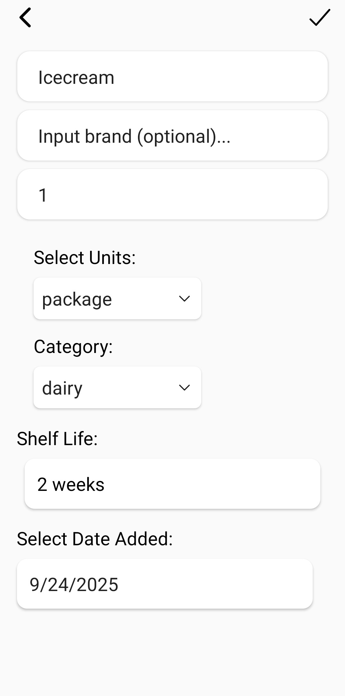
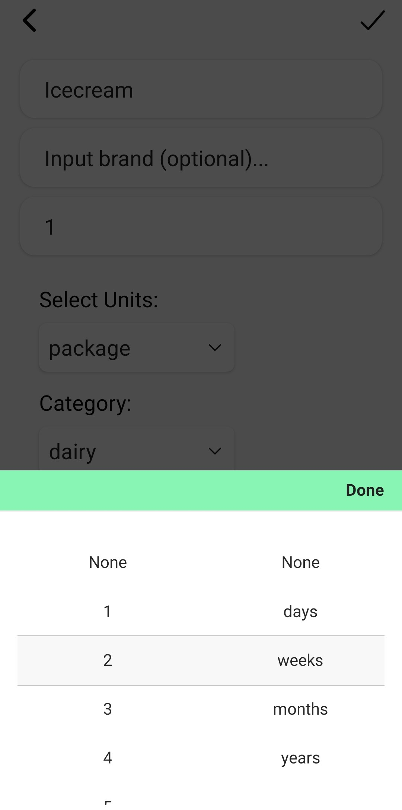
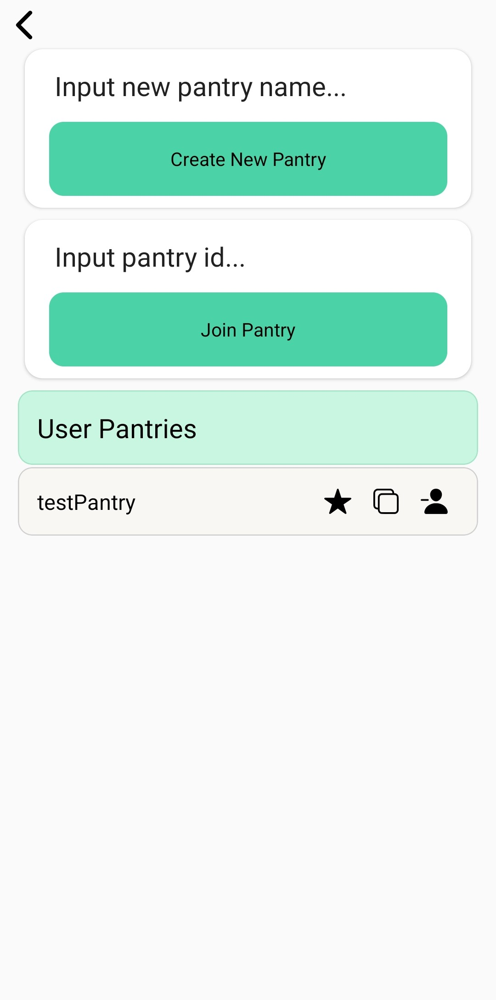

# Pantry Track
**PantryTrack** is a mobile application that helps users manage household inventory and shopping lists. It also allows for tracking of item shelf-life to help reduce waste.

## Features
- **Add & Edit Items:** Easily add or edit pantry/shopping list items with details like quantity, brand, unit, category, and shelf life.  
- **Barcode Scanning:** Quickly add items by scanning barcodes. The app remembers scanned items for future use.  
- **Multiple Pantries & Shopping Lists:** Manage multiple pantries and shopping lists, with the ability for other users to join shared pantries and lists. All data is synced via Firestore.  
- **Categorization & Search:** Items are organized by categories (user-specified, with auto-generated defaults for common items) and can be quickly found using search.  
- **Swipe Actions:** Move items between pantry and shopping list or delete them with a single swipe.  
- **Batch Operations:** Check off items in the shopping list and batch transfer them to a pantry for fast bulk updates.

## Tech Stack
- **Frontend:** React Native
- **Backend / Database:** Firestore, some local caching via AsyncStorage
- **Authentication:** Firebase Email/Password
- **Barcode Scanning:** Expo Camera
- **Development & Testing:** Expo and Expo Go

## Installation
**Users must provide their own Firebase configuration configured with Email/Password Authentification and Firestore. Details on how to do this can be found in the official Firebase documentation: https://firebase.google.com/docs/web/setup**
1. Clones the repository:
```
git clone https://github.com/armeach/PantryTrack
cd PantryTrack
```
2. Install dependencies:
```
npm install
```
3. Add your Firebase configuration: Copy your *google-services.json* (Android) and/or *GoogleService-Info.plist* (iOS) into the appropriate platform folders.
4. Run on device or emulator:
```
npx react-native run-android
npx react-native run-ios
```

## Usage
- Launch the app on your device or emulator.
- Login/Signup using the Settings Menu located in the top-right (stacked hamburger icon).
- Once logged in:
  - Create a pantry/shopping list:
    - In the Settings Menu select *Manage Pantries* or *Manage Shopping Lists*
    - Input the name of your new pantry/shopping list and click *create*.
  - Join a pantry/shopping list:
    - In the *Manage Pantries* or *Manage Shopping Lists* screen, input the ID of the pantry/shopping list you want to join.
    - IDs can be copied from the *User Pantries* or *User Shopping Lists* list in the respective management screen.
  - Favorite a pantry/shopping list:
    - Select the star icon in *User Pantries* or *User Shopping Lists* to favorite a pantry/shopping list. This will be the default loaded on app start-up.
  - Leave a pantry/shopping list:
    - Select the minus-person icon in *User Pantries* or *User Shopping Lists* to leave a pantry/shopping list. 
- On the main screen the lower navigation bar will direct you to: 
  - **Home**
    - In the **Home** tab the current active pantry items are displayed.
    - Users can use the Search Bar to quickly find items in this pantry.
    - Some filtering such as "expired:true" enables users to quickly identify items. Additional filtering options may be added in the future.   
  - **Pantry**
    - In the **Pantry** tab the user can swap between pantries using the dropdown menu. The currently selected pantry items will display.
    - Clicking on any item category will display all items within that category.
      - All categories can be expanded by selecting the **down arrow** icon in the bottom right corner. Selecting this again will collapse all categories.
      - Clicking on an individual item will allow the user to edit that item entry.
      - Swiping left will delete the item.
      - Swiping right will move the item into the active shopping list.
    - The **plus** icon in the bottom right allows the user to add items to the active pantry.
      - The *plus* icon in this sub-menu allows the user to manually input item details.
      - The *barcode* icon in this sub-menu allows the user to scan a barcode and then input item details. If a barcode has previously been scanned the item details will be auto-populated but still can be edited by the user. 
  - **Shopping List**
    - In the **Shopping List** tab the user can swap between shopping lists using the dropdown menu. The currently selected shopping list items will display.
    - Core functionality is similar to that of the **Pantry** tab with these key differences:
      - Swiping right will *not* move the item to the active pantry.
      - Items in the list can be *checked* using the checkbox on the right-side of the list during shopping.
        - All *checked* items can be moved to the active pantry by selecting the **plus**icon in the bottom right and selecting the **right-arrow** icon.

## Future Improvements
- Enable device-local pantries/shopping lists alongside Firestore syncing.  
- Push notifications for items nearing expiration.  
- More robust pantry management, including removing users and completely deleting pantries.  
- Enhanced barcode database integration for auto-populating item details using the OpenFoodFacts API.  
- Analytics and usage stats to track inventory trends and reduce waste.  
- Additional themes for UI customization.

## Next Steps
- Recipe suggestions based on pantry items and user food preferences.

## License
This project is licensed under the MIT License. See the [LICENSE](LICENSE) file for details.

## App Icon
Generated using [Expo Icon Builder](https://expo-icon-builder.com/), which uses [Twemoji](https://github.com/twitter/twemoji) (open-source emoji library).

## Screenshots
<table>
  <tr>
    <td></td>
    <td></td>
    <td></td>
  </tr>
  <tr>
    <td></td>
    <td></td>
    <td></td>
  </tr>
</table>
